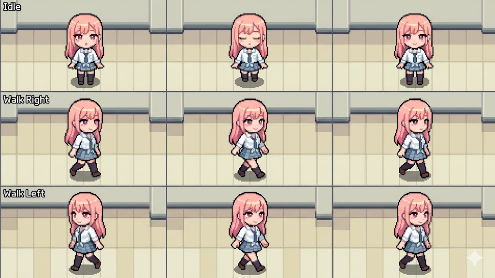

# desktop-girl



A tiny macOS desktop pet. A chibi girl walks slowly along the bottom of your main display — stand still for a moment, then to the left, then to the right, on a quiet 3-second loop.

## What it does

- Lives at the bottom of your main screen, just above the Dock
- Runs a fixed cycle: idle → walk left → walk right → repeat (3 seconds each)
- Click-through window: never blocks your cursor or hides desktop icons
- Visible across all Spaces and full-screen apps
- Menu bar icon for on/off and quit; no Dock icon

## Build

```bash
make venv      # one-time: create .venv and install Pillow + rembg
make sprites   # slice the 3x3 sheet, remove background, save 9 PNGs
make build     # compile Swift sources and assemble Marin.app
make run       # launch Marin.app
```

## Stack

- Swift + AppKit, native `NSStatusItem` menu bar
- `rembg` (`u2net` model) for background removal at build time
- Single ~100 KB binary inside a self-contained `.app` bundle

## Replace the character

Drop your own 3×3 sprite sheet into `assets/kitagawaasset.jpeg`:

- Row 0 — idle frames
- Row 1 — walking right frames
- Row 2 — walking left frames

Then run `make sprites && make build && make run`.
